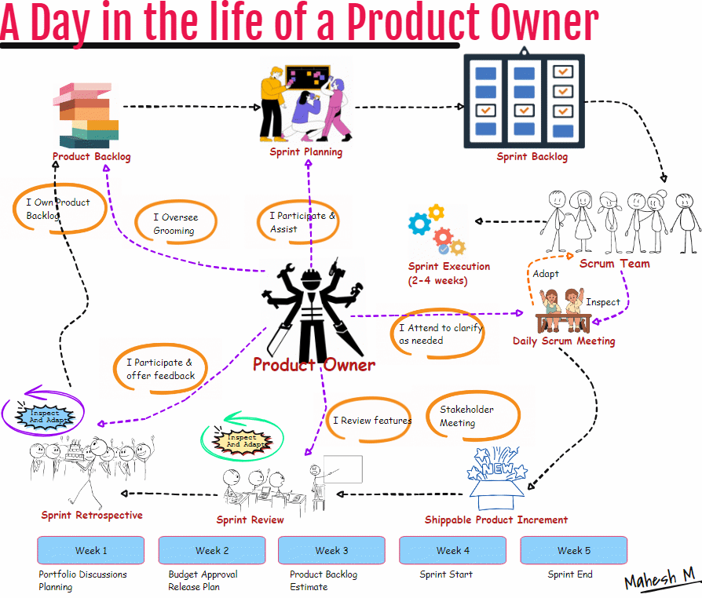

## Product Owner Responsiblities
The product owner has a vital role in the scrum.

The product owner envisions the product and owns the product backlogs that meet the requirements of the stakeholders and customers on one side, and on the other side, PO works with the scrum team to deliver those requirements.

Some product owner responsibilities include Grooming product backlog, planning, working with the scrum team, collaborating with stakeholders, and defining acceptance criteria.

A PO is a highly skilled role with domain, people, and decision-making skills. 

A PO is visionary, good at planning, a motivator, and a communicator, has strong decision-making capabilities, and is responsible for the product.

The product owner is involved in the portfolio and product planning. PO works with the leadership group to discuss portfolio expectations and sets goals for the new product release. The leadership group approves the product planning. After approval, PO starts with product backlog creation, grooming, story writing workshop, etc.

The Product Owner actively engages in story estimation workshops, contributing their insights to assist the Scrum team in accurately gauging the scope and intricacies of the tasks ahead. This collaborative approach ensures a cohesive and synchronized effort toward achieving the product vision within the confines of the Scrum methodology.

The Product owner also oversees the sprint planning activities, attends daily scrum whenever possible and needed, and gets insights into the progress.

PO also tests out the features and meets with stakeholders to iron out requirements and priorities for the upcoming sprints.

